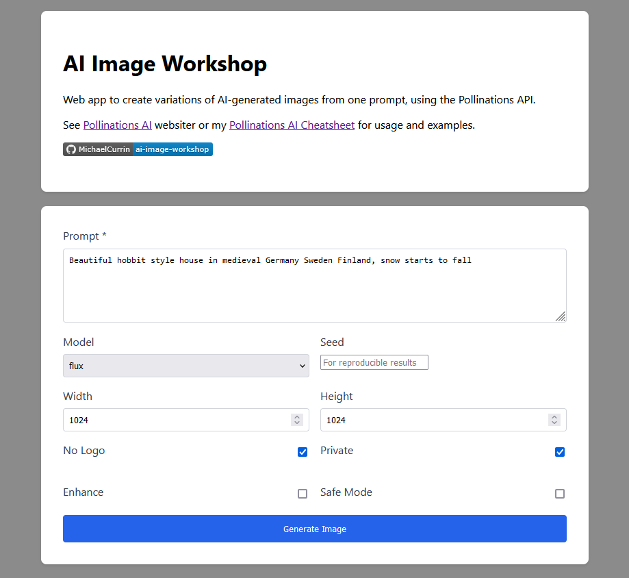
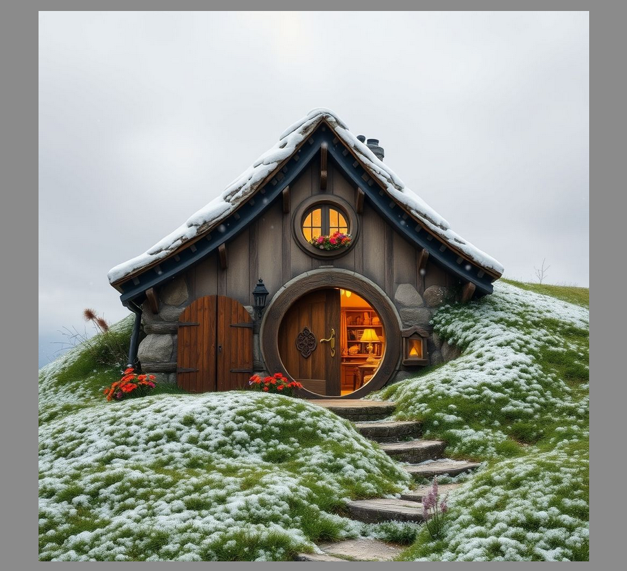

# AI Image Workshop
> Web app to create variations of AI-generated images, using the Pollinations API

See [pollinations.ai](https://pollinations.ai/) website.

## Purpose

- Iterate rapidly, comparing results immediately such as when varying dimensions or model.
- No cost and no auth needed (though you might hit speed or rate-limiting with high use).

## Preview

## Web app

## License

Released under [MIT](/LICENSE) by [@MichaelCurrin](https://github.com/MichaelCurrin).

A copy of the original license must be included if a significant portion of this template or project is used. You could rename it to `LICENSE-source` and then include your own `LICENSE` file with your name.
